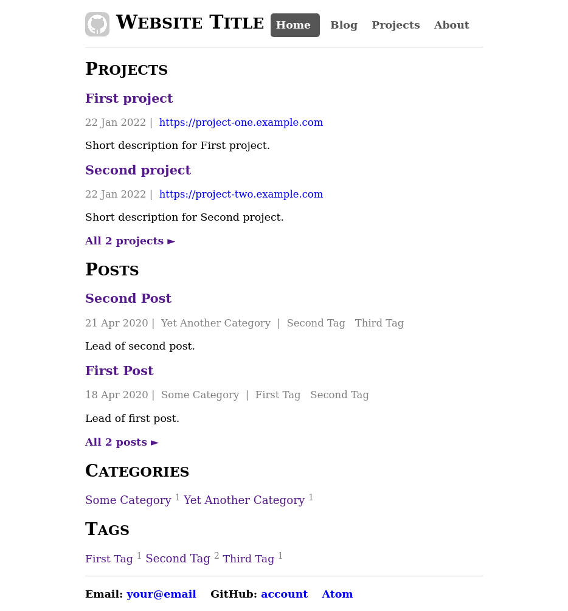
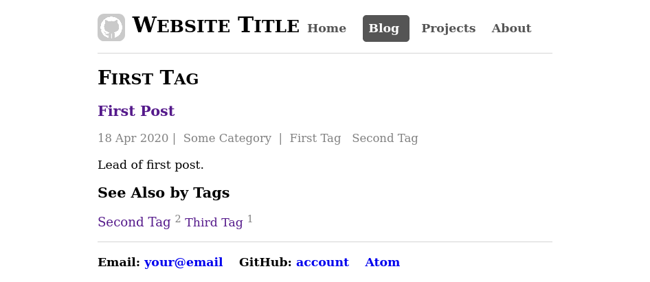

# Jekyll Template

This Jekyll template configured to use with GitHub Pages.

It supports:

- _Home page_ with short list of posts, projects, category clowd, tag clowd,
  header with navigation menu, and footer.
  
- Posts with one category and tags.
- Section "Posts" with full list of posts.
- Section "Projects" with full list of projects.
- _Tag system_ with support of related tags if necessary, and
  with page for each tag with full list of posts, and
  subsection "See Also by Tags".
  
- About page.

## Previously

- Install Ruby <https://www.ruby-lang.org>:

  ``` shell
  sudo apt install ruby ruby-dev
  ```

- Setting up Ruby: add to .profile:

  ``` plain
  if [ -d "$HOME/.local/share/gem/ruby/3.0.0" ] ; then
    RUBY_PATH="$HOME/.local/share/gem/ruby/3.0.0"
    export RUBY_PATH
    GEM_HOME="$RUBY_PATH"
    export GEM_HOME
    PATH="$RUBY_PATH/bin:$PATH"
  fi
  ```

- Install Ruby gems `bundler` and `jekyll`:

  ``` shell
  gem install bundler jekyll --user-install
  ```

- Copying contents of this repository. No need to clone or fork it!
  Unless of course you are going to improve this template and make a pull request.

## Configuring

Edit this files:

- `_config.yml`: edit your personal data.
- `_posts`: add your posts.
- `_categories`: add your categories.
- `_tags`: add your tags.
- `_projects`: add your projects.
- `about.html`: write something about you.
- `Gemfile`: add Jekyll plugins if you need.

To change limits for showing posts and projects in list in Home page edit
in `index.html` constants `post-list-limit` and `project-list-limit`
in frontmatter.

## Building

``` shell
bundle install
bundle exec jekyll build
```

## Preview

``` shell
bundle exec jekyll serve --incremental --livereload
```

## Updating

``` shell
bundle outdated
bundle update github-pages
```

## Posts adding

- Open folder `_posts` and add a new file into her by sample.
- Then don't forget to remove these examples.
- For posts use `post` layout.

## Tags adding

- Open folder `tags` and add a new file into her in slug name format by sample.
- Then don't forget to remove these examples.
- For tag page use `tag` layout.
- In order for the tag to appear in the tag cloud, it must be used in some post.

## Categories adding

- Open the folder `categories` and add a new file into her in slug name format
  by sample.
- Then don't forget to remove these examples.
- For category page use `category` layout.
- In order for the category to appear in the category cloud,
  it must be used in some post.

## Projects adding

- Open the folder `_projects` and add a new file into her by sample.
- Then don't forget to remove these examples.
- For project page use `project` layout.
- Categories and tags are not applicable for projects. (Is it necessary?)

## What's next?

Read the [Jekyll documentation](https://jekyllrb.com/docs/) and check with
[GitHub Pages documentation](https://help.github.com/en/github/working-with-github-pages/setting-up-a-github-pages-site-with-jekyll).

## License

(CC)(0)

(c) Evgeny Simonenko, 2020-2022
